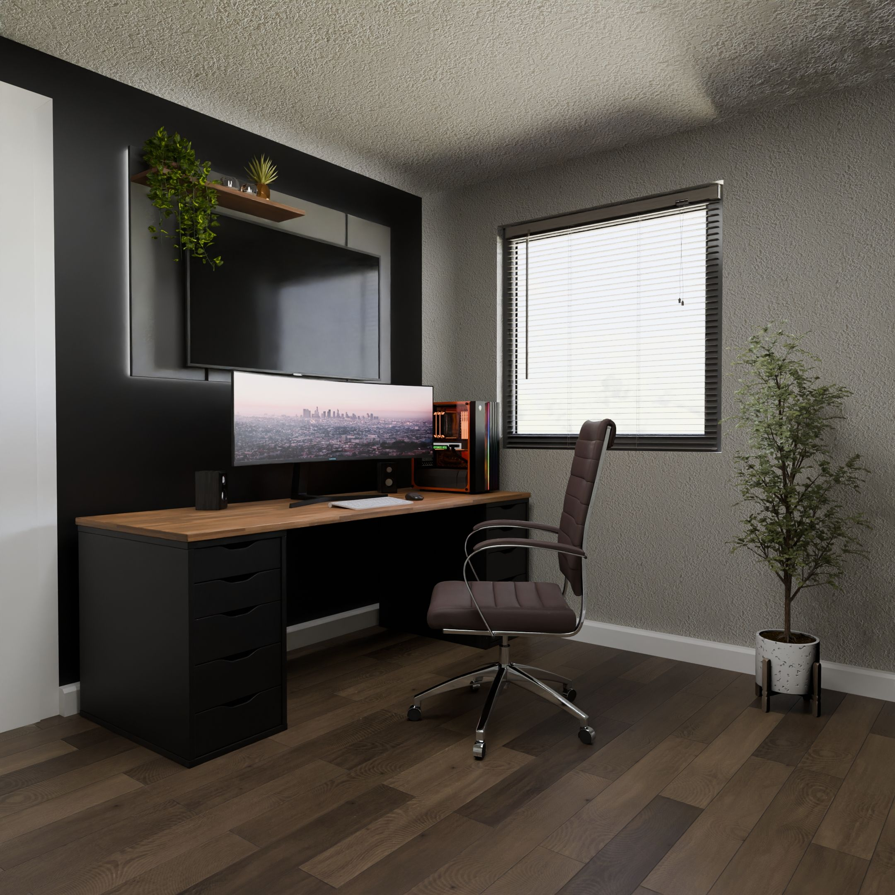

# FYP[homepage.html](https://github.com/user-attachments/files/31985953/homepage.html)
<!doctype html>
<html lang="en">

<head>
  <meta charset="UTF-8">
  <meta name="viewport" content="width=device-width, initial-scale=1">
  <meta name="description"
    content="WebHub SDN BHD — modern websites, branding and digital marketing for growing businesses.">
  <title>WebHub SDN BHD</title>
  <link rel="preconnect" href="https://fonts.googleapis.com">
  <link rel="preconnect" href="https://fonts.gstatic.com" crossorigin>
  <link href="https://fonts.googleapis.com/css2?family=Inter:wght@400;500;600;700;800&display=swap" rel="stylesheet">
  <link rel="stylesheet" href="css/homepage_style.css">
</head>

<body>
  <header class="site-header" id="top">
    <nav class="navbar" aria-label="Main navigation">
      <a href="#home" class="nav-logo" aria-label="WebHub home">
        
        WEBHUB
      </a>

      <button class="nav-toggle" id="navToggle" aria-label="Toggle menu" aria-expanded="false" aria-controls="navLinks">
        
      </button>

      <ul class="nav-links" id="navLinks">
        <li><a href="#about">About</a></li>
        <li><a href="services.html">Services</a></li>
        <li><a href="portfolio.html">Portfolio</a></li>
        <li><a href="pricing.html">Pricing</a></li>
        <li><a href="#contacts" class="nav-cta">Contact us</a></li>
      </ul>
    </nav>
  </header>

  <main>
    <section id="home" class="section section-light hero-section">
      

        

          WEBSITE • BRANDING • DIGITAL
          <h1>Build your brand Grow your business</h1>
          
We create modern websites and digital solutions that help small businesses look professional, reach more
            customers and grow online.

          

            <a class="button button-dark" href="portfolio.html">View our work ↗</a>
            <a class="button button-ghost" href="#contacts">Start a project</a>
          

        

        

          

            
            
            
          

        

      

    </section>

    <section id="about" class="section section-dark">
      

        

          01 / ABOUT
          <h2>Websites that look sharp and work hard</h2>
        

        

          

            
We build websites that help businesses grow.

            
WebHub is focused on helping small and medium-sized businesses build a professional online presence with
              responsive, user-friendly digital experiences.

          

          

            
            

              <strong>WebHub SDN BHD</strong>
              Creative digital partner
            

          

        

      

    </section>

    <section id="vmo" class="section section-light">
      

        

          

            02 / DIRECTION
            <h2>Clear Goals  Practical Digital Work</h2>
          

          
We combine thoughtful design with business-focused execution.

        

        

          <article class="vmo-card dotted-card reveal">
            01
            
            <h3>Vision</h3>
            
Help small and medium businesses in Kuala Lumpur and Selangor go digital in the next 10 years.

          </article>
          <article class="vmo-card dotted-card reveal">
            02
            
            <h3>Mission</h3>
            
Provide professional, creative and high-quality website design services.

          </article>
          <article class="vmo-card dotted-card reveal reveal-delay">
            03
            
            <h3>Objective</h3>
            
Build professional websites that are easy to use, easy to maintain and ready to support business growth.
            

          </article>
        

      

    </section>

    <section id="member" class="section section-dark">
      

        

          

            03 / TEAM
            <h2>Small team  Focused Expertise</h2>
          

          
Design, Development and Marketing working together under one roof.

        

        

          <article class="member-card reveal">
            

            

              WEB DEVELOPER + UI/UX
              <h3>Tham Zhi Cheng</h3>
              
Develops websites and ensures every digital experience works smoothly.

            

          </article>
          <article class="member-card reveal reveal-delay">
            

            

              CEO
              <h3>Tan Wai Phui</h3>
              
Leads the company, manages projects and keeps the team aligned with client goals.

            

          </article>
          <article class="member-card reveal">
            

            

              MARKETING EXECUTIVE
              <h3>Chong Wah Xiang</h3>
              
Handles marketing, social media and brand promotion across digital channels.

            

          </article>
        

      

    </section>

    <section id="why" class="section section-light">
      

        

          

            04 / WHY WEBHUB
            <h2>Good Design with a  Business Purpose</h2>
          

        

        

          <article class="why-row reveal">
            01
            

            

              <h3>Modern &amp; Professional Design</h3>
              
Clean, considered websites that strengthen your online presence and leave a confident first impression.
              

            

          </article>
          <article class="why-row reveal">
            02
            

            

              <h3>All-in-One Digital Solutions</h3>
              
Website design, branding and digital marketing coordinated as one consistent visual system.

            

          </article>
          <article class="why-row reveal">
            03
            

            

              <h3>Business-Focused</h3>
              
We look beyond appearance and focus on how your website can attract customers and support growth.

            

          </article>
        

      

    </section>

    <section id="services" class="section section-dark">
      

        

          

            05 / SERVICES
            <h2>Everything your Digital Presence Needs</h2>
          

          <a class="text-link" href="#contacts">Discuss your project ↗</a>
        

        

          <article class="service-card reveal">
            

            01
            <h3>Web Design</h3>
            
Modern, professional and responsive websites designed for small and medium-sized businesses.

          </article>
          <article class="service-card reveal reveal-delay">
            

            02
            <h3>Brand Identity</h3>
            
A clear visual style built from thoughtful colors, typography, logos and design elements.

          </article>
          <article class="service-card reveal">
            

            03
            <h3>Digital Marketing</h3>
            
Practical digital marketing support to help your business reach and connect with more customers.

          </article>
        

      

    </section>

    <section id="portfolio" class="section section-light">
      

        

          06 / PORTFOLIO
          <h2>Selected work &amp; Client Projects</h2>
          
Explore the portfolio page for a continuously moving client showcase

          <a class="button button-dark" href="portfolio.html">Explore portfolio →</a>
        

        

          <article class="preview-card">
            
            
PROJECT / 01<strong>LM Studio</strong>

          </article>
          <article class="preview-card offset">
            
            
PROJECT / 02<strong>Bangollo</strong>

          </article>
        

      

    </section>

    <section id="pricing" class="section section-dark">
      

        

          

            07 / PRICING
            <h2>Simple starting points for every Stage</h2>
          

          
Final scope and quotation depend on project requirements.

        

        

          <article class="price-card reveal">
            
BASIC01

            <h3>RM4XX<small>/year</small></h3>
            <ul>
              <li>1–3 pages</li>
              <li>Template-based website</li>
              <li>Responsive layout</li>
              <li>Essential contact section</li>
            </ul>
            <a href="#contacts">Enquire →</a>
          </article>
          <article class="price-card featured reveal reveal-delay">
            
NORMAL02

            <h3>RM9XX<small>/year</small></h3>
            <ul>
              <li>5–8 pages</li>
              <li>Semi-custom website design</li>
              <li>Responsive layout</li>
              <li>Stronger brand customization</li>
            </ul>
            <a href="#contacts">Enquire →</a>
          </article>
          <article class="price-card reveal">
            
VIP03

            <h3>RM1XXX<small>/year</small></h3>
            <ul>
              <li>10+ pages</li>
              <li>Fully custom website design</li>
              <li>Advanced content structure</li>
              <li>Priority design support</li>
            </ul>
            <a href="#contacts">Enquire →</a>
          </article>
        

      

    </section>

    <section id="contacts" class="section section-light contact-section">
      

        

          08 / CONTACT
          <h2>Have a Project in Mind?</h2>
          
Tell us what you are planning. We can communicate in Chinese, Malay, English and Cantonese.

          

            
EMAIL<a href="mailto:webhub@gmail.com">webhub@gmail.com</a>

            
PHONE<a href="tel:+60112223456">011-222-3456</a>

            
LOCATION<strong>Setapak, Malaysia</strong>

          

        

        <form id="contact-form" class="contact-form reveal reveal-delay">
          <label>Name<input type="text" name="name" placeholder="Your name" required></label>
          <label>Contact number<input type="tel" name="phone" placeholder="01X-XXXXXXX" required></label>
          <label>Email<input type="email" name="email" placeholder="example@gmail.com" required></label>
          <label>Tell us about your project<textarea name="message" rows="5" placeholder="What would you like to build?"
              required></textarea></label>
          <button class="button button-dark submit-button" type="submit">Send enquiry ↗</button>
          

        </form>
      

    </section>
  </main>

  <footer class="site-footer">
    

      

        
<strong>WEBHUB SDN BHD</strong>Designing digital growth.

      

      
<a href="#about">About</a><a href="services.html">Services</a><a
          href="portfolio.html">Portfolio</a><a href="pricing.html">Pricing</a><a href="#contacts">Contact</a>

      

    

    
©  WebHub SDN BHDMonday–Friday ·
        9am–5pm

  </footer>

  
  <button class="back-to-top" id="backToTop" type="button" aria-label="Back to top">↑</button>

  
</body>

</html>
